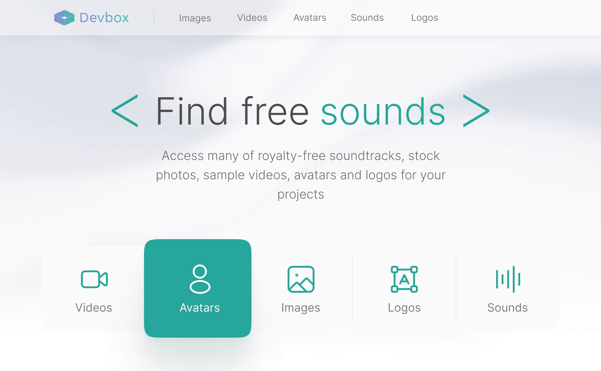

# Devbox
### Mock data generation for developers
 
Devbox is a concept idea to bring mock data to your development environment.

This application is built using Nuxt 3 and Tailwind CSS. Its backend is a WordPress website with GraphQL API.

Go to [live demo](https://devbox-moeinmirkiani.vercel.app/).

If you have any questions about the implementation of the frontend or the backend of this application, please contact me on [Telegram](https://t.me/moein_mirkiani) or [LinkedIn](https://www.linkedin.com/in/moeinmirkiani/).